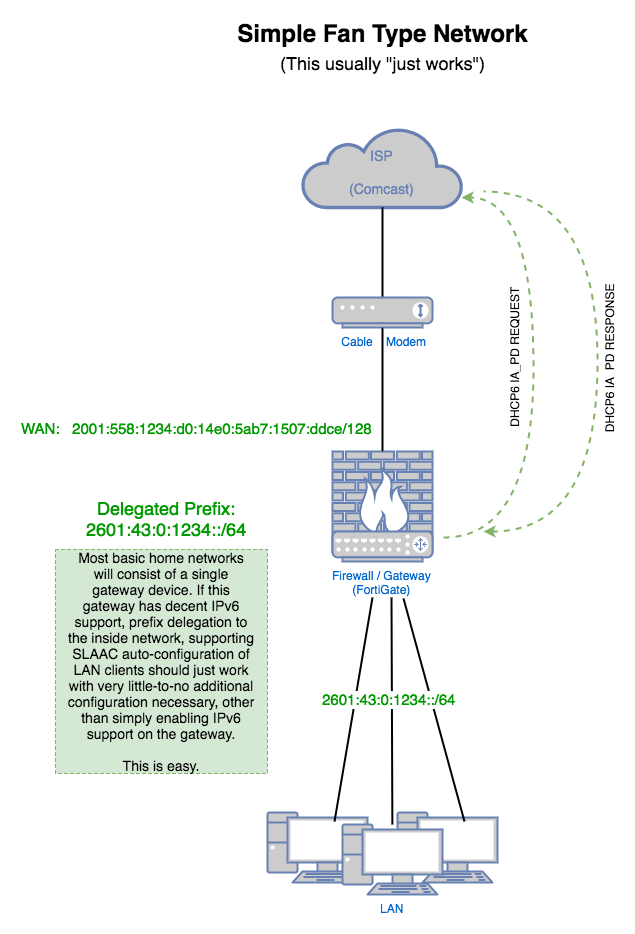

## Diagram

(network addresses in examples have been randomized... to protect the innocent)

## Description

This is the type of home network that most people are familiar with. The gateway device may simply be a typical Wi-Fi router or similar device, acting as the sole gateway to the ISP, and providing some sort of basic security via <a href="#" data-toggle="tooltip" data-original-title="{{site.data.glossary.SNAT}}">SNAT</a> and (hopefully) even an actual firewall. This gatway is the only actual router on the network.

## Adding IPv6

Unless you like to live on the bleeding edge, and enjoy internet service of dubious reliability, currently (as of 2017) you are probably going to be implimenting <a href="#" data-toggle="tooltip" data-original-title="{{site.data.glossary.dual-stack}}">dual-stack</a> networking, using both IPv4 and IPv6 addressing. In dual-stack, addresses for each protocol are conigured independenly, and function independently. This is meant to be a transitional mode, used while more sites ramp up their IPv6 support, and IPv4 is eventually phased out. For now, cover all bases - run both.

Once IPv6 is enable on the gateway, it will automatically obtain a individual ::/128 address from the ISP, which will be used on it's upstream (or external) interface. At this point, you have a couple of options:

* you could configure a private IPv6 (<a href="#" data-toggle="tooltip" data-original-title="{{site.data.glossary.ULA}}">ULA</a>) network on the inside network, and continue doing SNAT, or
* have your gateway device request a "<a href="#" data-toggle="tooltip" data-original-title="{{site.data.glossary.prefix-delegation}}">prefix delegation</a>" of routable addresses from the ISP for use on your inside network

For the purposes of this discussion, we will be using a delegated prefix of publicly-routable addresses, which sort of implies that the gateway device is also  a stateful firewall, as assigning public addresses to your internal hosts without some sort of firewall would be utter foolishness (under most circumstances).

This prefix delegation is initiated by the <a href="#" data-toggle="tooltip" data-original-title="{{site.data.glossary.cpe}}">CPE</a> gateway, which issues a DHCP6 IA_PD request (described in [RFC 3633]) to the ISP. The ISP then allocates a prefix, and sends teh DHCP6 response back to the gateway with the prefix details. **By default, this will probably be a ::/64 prefix**.

{% include note.html content='A word aobut IPv6 prefixes, shall we? Total address space is 128 bits, however the largest prefix (smallest netblock) which should be delegated for a network is 64 bits in size. That means, the **smallest** IPv6 network consists of **~18.4 quintillion** addresses, give or take a few quadrillion. You may be thinking, "ZOMG! WE\'RE WASTING SPACE! WE\'RE GOING TO RUN OUT OF ADDRESSES IN NO TIME!" Well, don\'t worry... that\'s a common reaction. If it helps, please just consider that there\'s still 64 bits left for the network portion of the address - that\'s like **~10 orders of magnitude** more addresses than the entire IPv4 internet, **just** for the network prefixes! In other words, don\'t sweat it. We\'ll talk more abou this later, but for now... just let it sink in for a bit.' %}

At this point, any gateway worth it's salt has configured it's interfaces with the appropriate addresses, and due to the _magic of IPv6_, any IPv6-enabled hosts on the inside network should auto-configure themselves with a real-live routable IPv6 address. This was a lot of words about a really simple process - it probably only required clicking a check-box in the gateway config GUI, if you had to do anything at all.

-----

**[Introduction](index.html) <- Previous Page \| Next Page -> [Example Tree Network](tree.html)**

-----

[RFC 3633]: https://tools.ietf.org/html/rfc3633
