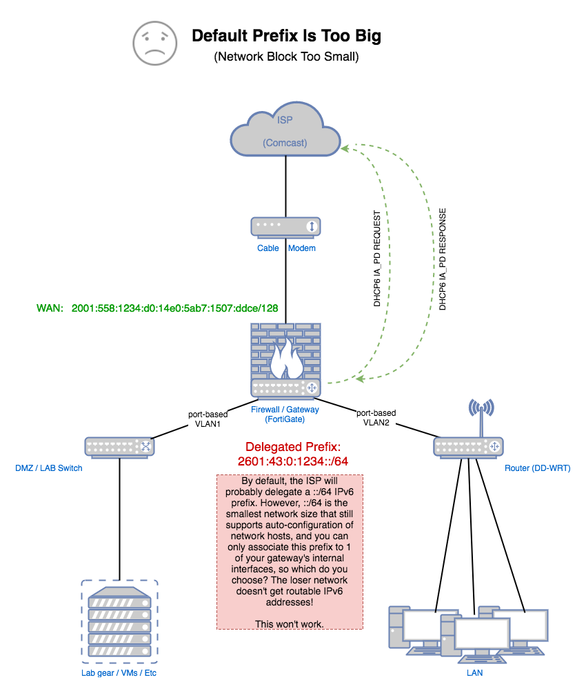

## An embarrassment of riches? Perhaps not...

As previously mentioned, there's a good chance that the _default_ prefix delegation you'll get from your ISP is a ::/64. And if you recall from the discussion on the [fan network](fan.thml) page, this is the smallest IPv6 network (largest prefix) that you can have. Sort of. Technically, you can have larger prefixes and the ~18.4 quintillion (give or take) addresses that you now have give you alot of room to work with. You may be inclined to try splitting this ::/64 into something like two ::/65 networks, or four ::/66 networks, and so forth. You could put in some effort and assign these carved up netblocks to your different VLANs, install routes, address your router interfaces, etc, etc, etc. And then you start connecting up your IPv6-capable devices to the inside router only to find that if you want them to work, you'll have to manually configure an IPv6 address on them. But if you recall, this defeats the _promise of IPv6_... simple autoconfiguration of hosts.

Sadly, this is all because...

## Prefixes larger than a ::/64 simply don't support autoconfiguration

<a href="#" data-toggle="tooltip" data-original-title="{{site.data.glossary.SLAAC}}">SLAAC</a> works fantastically with a ::/64 network. It doesn't work **at all** with a ::/65, or a ::/66, ::/67, etc, etc, etc. You may wonder why. Well, the answer is _"Because. Deal with it."_ OK, there are reasons, but they're outside the scope of this conversation, and much has been written about this on the Internet already, so feel free to google it. The "whys" simply aren't that important at this point... you just need to understand that it doesn't work with prefixes bigger than ::/64 and that it's by-design, and not going to be changing.

It's great that you have this shiny new ::/64 delegation from your ISP. It's sad that you can't really use it on anything other than a basic fan network. Very sad. It still has that new prefix smell, even.

So, what now?

## Ask for a smaller prefix (bigger network)

Any decent gateway device that supports [RFC 3633] delegation requests _should_ allow you to set a prefix "hint" for the upstream delegation server. This causes the delegation client to ask for a prefix other than the default (which the ISP may or may not honor). What the limit is for the size of delegatable prefix may vary from ISP to ISP, and you may not know what that limit is in advance, so try to keep your prefix hint at a reasonable size.  ::/63  == two ::/64 networks, ::/62 == four networks, ::/61 == eight networks, and so on. There are some pretty good [IPv6 calculators] out there that help you see how big each prefix actually is. In any case, no need to be greedy - just request what you think you reasonably will need. I've been able to obtain a ::/60 from Comcast, which is more than enough for most SOHO-type needs, IMHO.

If you are getting the default ::/64 prefix, and make a change to the hint, it may take some time before the you see that change take effect, so don't expect it to be immediate. At least, it wasn't for me - I think it was a day or two before I finally noticed the new prefix delegation showing up on my gateway. YMMV.

-----

**[Example Tree Network](tree.html) <- Previous Page \| Next Page -> [Solution - Get a smaller prefix](solution_prefix.html)**

-----

[IPv6 calculators]: https://subnettingpractice.com/ipv6_subnetting.html
[RFC 3633]: https://tools.ietf.org/html/rfc3633
