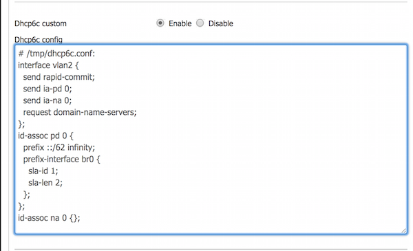

<ul id="profileTabs" class="nav nav-tabs">
    <li class="active"><a href="#fortigate" data-toggle="tab">FortiGate</a></li>
    <li><a href="#dd-wrt" data-toggle="tab">DD-WRT</a></li>
</ul>
  <div class="tab-content">
    <div role="tabpanel" class="tab-pane active" id="fortigate">

        <p>
				<b>Note: FortiOS v5.6.2 build1486 (17 August 2017) firmware is used as of this writing.</b>
				</p>
				<p>
				Configure the upstream WAN interface for DHCP with an IA_PD prefix delegation request. Specify a 62-bit prefix hint:
				</p>
				<p>
				<pre>config system interface
    edit "wan"
        config ipv6
            set ip6-mode dhcp
            set ip6-allowaccess ping
            set dhcp6-prefix-delegation enable
            set dhcp6-prefix-hint ::/62
        end
    next
end </pre>
			</p>
			<p>
			Configure two inside interfaces, <i>vlan1</i> and <i>vlan2</i>, in delegated mode. Assuming our hypothetical delegated prefix is <i>2601:43:0:1000::/62</i>, the first interface, <i>vlan1</i> gets configured with the address <i>2601:43:0:100<font color="red"><b>0::1/64</b></font></i> (set ip6-subnet ::1/64). It then advertises the prefix <i>2601:43:0:100<font color="red"><b>0::/64</b></font></i> to other hosts connected to this link for SLAAC autoconfiguration.
			</p>
			<p>
			<i>vlan2</i> get s a similar configuration, except it's interface address ends up as <i>2601:43:0:100<font color="red"><b>1::1/64</b></font></i>, and the advertised prefix is <i>2601:43:0:100<font color="red"><b>1::/64</b></font></i>
			</p>
			<p>
			<pre>config system interface
    edit "vlan1"
        config ipv6
            set ip6-mode delegated
            set ip6-allowaccess ping
            set ip6-send-adv enable
            set ip6-manage-flag enable disable
            set ip6-other-flag enable
            set ip6-upstream-interface "wan"
            set ip6-subnet ::1/64
            config ip6-delegated-prefix-list
                edit 1
                    set upstream-interface "wan"
                    set autonomous-flag enable
                    set onlink-flag enable
                    set subnet ::/64
                    set rdnss-service delegated
                next
            end
        end
    next
end

config system interface
    edit "vlan2"
        config ipv6
            set ip6-mode delegated
            set ip6-allowaccess ping https http
            set ip6-send-adv enable
            set ip6-manage-flag enable disable
            set ip6-other-flag enable
            set ip6-upstream-interface "wan"
            set ip6-subnet 0:0:0:1::1/64
            config ip6-delegated-prefix-list
                edit 1
                    set upstream-interface "wan"
                    set autonomous-flag enable
                    set onlink-flag enable
                    set subnet 0:0:0:1::/64
                    set rdnss-service delegated
                next
            end
        end
    next
end</pre>
			</p>
			<p>
			A few notes on relavent options:
			<ul>
			<li><b>ip6-send-adv</b> - send route announcements on this interface (with 1 or more prefixes defined in the list below)</li>
			<li><b>ip6-manage-flag</b> - <i>I think there's a FortiOS bug here;</i> should be used to announe that addresses <i>can</i> be assigned via stateful DHCP6, but I'm not doing that, and I can't remove this line or I lose all RA options, and the value "enable disable" makes no sense</li>
			<li><b>ip6-other-flag</b> - "other" network info (e.g. DNS servers) is available via DHCP6 for clients that can make use of it</li>
			<li><b>ip6-subnet</b> - network address to assign to this inetface from the delegated prefix</li>
			<li><b>autonomous-flag</b> - flag that tells hosts on this link that they can use this announced prefix to autoconfigure themselves via SLAAC</li>
			<li><b>onlink-flag</b> - tells hosts that addresses in this prefix are "link-local", or directly accessible rather than having to foward packets for them to a router</li>
			<li><b>subnet</b> - the network to advertise (relative to the delegated prefix); this is an implicit address (similar to the "ip6-subnet" parameter above). A good way to think about this is that the address specified here is "added" to the delegated prefix to come up with an actual network address, so if your upstream delegation changes, your downstream prefix advertisement will automatically update as well</li>
			<li><b>rdnss-service delegated</b> - uses the DNS servers provided in the upstream delegation, and advertise them to hosts on this network</li>
			</ul>
			</p>
      </div>

      <div role="tabpanel" class="tab-pane" id="dd-wrt">

        <p>
				<b>Note: DD-WRT v3.0-r32170 big (06/01/17) firmware is used as of this writing.</b> The firmware version I had been using previously did not have the <b>SETUP -> IPv6</b> tab.
				</p>
				<p>
				
				</p>
				<p>
				This is fairly self-explainatory - use DHCP6 to make a request upstream, and specify a 62-bit prefix hint.
				</p>
				<p>
				It is also necessary to add some custom configuration to the dhcp6c client, which is illustrated below (<a href="files/dd-wrt_dhcp6c-62-hint.conf">text version here</a>):
				</p>
				<p>
				
				</p>
				<p>
				If you want to read up more about these specific options, this <a href="https://www.freebsd.org/cgi/man.cgi?query=dhcp6c.conf">man page</a> is probably your best bet. The important bits in the IA_PD portion in a nutshell are:
				<ul>
				<li><b>prefix ::/62 infinity</b> - make an upstream request for a delegated ::/62 prefix with infinite lifetime</li>
				<li><b>sla-id 1</b> - assign subnet 1 to our inside interface, <i>br0</i>. If our delegated prefix is 2601:43:0:1000::/62, then this would result in 2601:43:0:100<b>1</b>:: being dynamically assigned here</li>
				<li><b>sla-len 2</b> - This value should be 64, minus whatever our delegated prefix is (62), and results in a ::/64 prefix being assinged to our <i>br0</i> interface; clear as mud, I know. I like to believe this is clearly documented <i>somewhere</i> - it helps me sleep better at night.</li>
				</ul>
				If your needs are different - prefix size, number of inside interfaces, etc, then these values will need to be tweaked to suit your purposes. This example simply results in the (hypothetical) prefix <i>2601:43:0:1001::/64</i> being assigned to our inside interface, <i>br0</i>, from a delegated prefix of <i>2601:43:0:1000::/62</i> which is received by our WAN interface, <i>vlan2</i> .
				</p>
				<p>
				Lastly, you need to configure <b>radv</b> on the DD-WRT <i>br0</i> interface in order to perform route advertisements to hosts on that network (<a href="files/dd-wrt_radv.conf">text version here</a>):
				</p>
				<p>
				
				</p>
				<p>
				Note that the Recursive DNS Servers (RDNSS) shown in this conifg are Comcast's. If you have a different ISP, you'll need different servers here... or, Google's servers perhaps.
				</p>
				
      </div>

</div>

-----



If client hosts aren't automatically picking up DNS servers, you will either need to configure a DHCP6 server to provide that option, or configure DNS on the clients manually. Fortunately, FortiOS supports this in its built-in DHCP6 server, for example:

```
config system dhcp6 server
    edit 1
        set dns-service delegated
        set interface "vlan1"
        set upstream-interface "wan"
    next
    edit 2
        set dns-service delegated
        set interface "vlan2"
        set upstream-interface "wan"
    next
end
```

This  will take the upstream DNS servers provided in the delegation, and provide them to DHCP6 clients on the two VLAN interfaces on the FortiGate. Alternatively, you can explicitly set DNS servers here as well.

Unfortunately, I've been unsuccessful so far getting either `dhcp6s` or `dnsmasq` on the DD-WRT
 router to provide DHCP6 DNS server options. If anyone has made that work, let me know in the comments!

-----

** [Problem 1- Prefix too big](prefix64.html) <- Previous Page \| Next Page -> [Problem 2 - Can't cascade](problem_cascade.html)**

-----